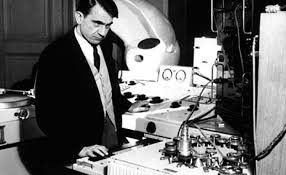

# Cox_Agglika_Ellinika

# Για τον Christoph Cox. Από την Τεχνική του Ήχου στην Τέχνη των Θορύβων;

 ΓΙΩΤΑ ΑΝΔΡΙΑΚΑΙΝΑ 

   

 <b> Για τον Christoph Cox.  
Από την Τεχνική του Ήχου στην Τέχνη των Θορύβων;    
</b>     
 <b> Steve Reich, Clapping Music, 1972 </b>        
 
 Μέρος 1: Μεταγραφή 8' χωρίου από διάλεξη του C. Cox  (11:40-19:40)

Α)Απομαγνητοφώνηση ενός αποσπάσματος διαρκείας 8 λεπτών από την εργασία 

Russolo was a futurist painter, not a composer. Αnd if you know anything about the futurists, they were big in large scale proclamations, and of relegating all of the past in the dustbin of history, [10.48]. So, Russolo said that contemporary orchestra is useless, traditional musical instruments are worthless, we now need a new art form, I m gonna called this -the Art of Noises – and we need new instruments to make that happen. [11.07]

In this text, in his manifesto, there is the longest quotation I have: 

11:40-19:40

«Musical sound is too limited in its variety of timbres […..] We must break out of this limited circle of sounds and conquer the infinity variety of noise sounds[….]. Let us cross a large modern capital with our ears more sensitive than our eyes. We will be delighted in distinguishing the eddying of water, air or gas in metal pipes, the muttering of motors that breath and pulse with an indisputable animality, the throbbing of valves, the bustle of pistons, the shrieks of mechanical saws, the starting of trams on the tracks, the cracking of whips, the flapping of awnings and flags. We will amuse ourselves by orchestrating together in our imagination the din of rolling shop shutters, the varied hubbub of train stations, iron works, thread mills, printing presses, electrical plants and subways».

It was his idea that all these urban sounds could be heard aesthetically, and, in a sense, needed to be heard aesthetically, because Russolo’s argument was that now ours ears crave for more noises, and that all of the sounds of the past are too sweet, too sickly. Well, whether this is or not actually true, this is another question. [12.23]

Despite the fact that Edison in 1878 invents this audio recording mechanism, this was not widely available …, it was not commercial available for some time, and certainly Russolo did not want a tape recorder. [12.48]

So instead, he took upon himself to construct an orchestra of instruments which he called it intonarumori… that is, noise and toners …, and to make this music which we still thought as his music, I suppose, in a way. And here is a very brief clip of this …

[sounds from intonarumori]

This is a recent recording. The original one was destroyed in a fire. This is a recent recording of a fragment we have from Russolo intonarumori [13.42].

Shortly after Russolo ‘s manifesto, the cultural fascination with noise was extended to poetry by futurists and dada artists who shot to eliminate meaning in favour of purely sonic values. 

I will play a quick extract of the most famous Kurt Schwitters Ursonate -1922-32 

[sounds by Kurt Schwitters]

Recent recording of Schwitters himself doing recording was worse than this one, which was done by a recent contemporary sound artist named Christian Bok.

So this reduction of language to voice and sound is a kind of constant feature throughout the history of sound poetry from the futurists in the 40’s and the letterists in the 50’s to Bob Kuban and contemporary sound artists, like Chrissie Morris and Christian Bok. 

These were various efforts to think about noise and sound vis a vis language.

When tape recorders become more commercial available to the portable tape recorders, became available in the 40’s, sonic artists finally begin to realize Rusollo’s vision, the vision of noise -the genre of noise.

And a key figure here was a French radio engineer turn to composer, Pierre Schaeffer, who at 1848 broadcast over French radio what he called the concert of noises, consisted of pieces that he composed entirely from editings and recordings of sounds he had made. And he thought of it as a kind of  transporting into sound the kind of montage techniques available in cinema.

The most famous of this is, of course, a recording of train sounds he recorded in Paris. 

I play a brief bit of this [sounds ]

Pierre Schaeffer at GRM Studio Paris 1951

Schaeffer called his compositon «concrete music» to distinguish it from instrumental music, which he called  «abstract music» because it had to pass through the detour of the composer, the composer had to pass that music through the detour of notation, and then, to the musicians performing. Whereas Schaeffer found that his music receive things from the world and just edit them directly  - and he thought of it as a much more concrete way of making music. 

We should know that earlier than Schaeffer - Schaeffer become an important figure that all the composers from Europe and other places flocked in his studio which became a center for avant garde music.

But earlier than that, actually in Egypt, a composer, a composer who was actually just beginning his life as a composer, Halim El-Dabh, began to compose on a wire recorder, that he had taken from Middle East, from Cairo.  He borrowed a recorded and started recording a piece he listened in Africa. The piece that remained of all this, is a piece he recorded at traditional Africa (this is his own description), part of a rite of exorcism. It is a short piece called The Expression of Zaar (It’s a ceremony called Zaar), women voices that are filtered in different ways. 

Β)Μετάφραση του απομαγνητοφωνημένου αποσπάσματος στα ελληνικά_    Σχόλια ή σκέψεις πάνω στο κείμενο.
 
<b> Πρόλογος –  Η Διάλεξη του κου Christoph Cox.</b>

 

Στόχος αυτής της εργασίας, η οποία ανατέθηκε στο πλαίσιο του μαθήματος «Διαδραστικός Ηχητικός Σχεδιασμός», είναι να στρέψει το ενδιαφέρον μας στη φιλοσοφία και την αισθητική του ήχου.  

Τον Ιανουάριο του 2017, ο Christoph Cox, καθηγητής φιλοσοφίας με γνωστικό αντικείμενο την ιστορία της τέχνης και τις πολιτισμικές σπουδές, έδωσε μια διάλεξη σε ένα από τα πιο διάσημα μουσεία της Αμερικής, στην Collection Gallery - Barnes Foundation που βρίσκεται στην πολιτεία της Φιλαδέλφειας.  

Η διάλεξη του Cox, καθηγητή στο Hampshire College της Μασαχουσέτης, έχει τον τίτλο A Brief History of Sound Art, ο οποίος θα μπορούσε να αποδοθεί στα ελληνικά ως εξής, Τέχνη του Ήχου, Μια Σύντομη Ιστορία.  

  
 <b>Christoph Cox makes sounds [lectures]  </b>                                       

Από την μακροσκελή διάλεξη του Cox, συνολικής διάρκειας σχεδόν δύο  ωρών, θα σας παρουσιάσω εδώ ένα μικρό απόσπασμα, αυτό που μου ζητήθηκε να αναλύσω, το οποίο βρίσκεται στο διάστημα 11:40-19:40.  

Ωστόσο, για να κατανοήσει κανείς το μικρό απόσπασμα από τη διάλεξη  θα πρέπει να έχει ως πλαίσιο το σύνολό της, και ίσως, για να καταφέρει μια εμβάθυνση στο αντικείμενο, θα πρέπει να έχει μια γνώση των έργων και των δημιουργών τους οποίους ο Cox αναφέρει και παραπέμπει στην ομιλία του.  

Όπως και νάχει όμως, ακόμα και στον πιο αδαή με το σχετικά νέο γνωστικό πεδίο, την ιστορία του ήχου, η διάλεξη του αμερικανού καθηγητή υπόσχεται διότι εξάπτει την φαντασία και προσφέρει κίνητρα για περαιτέρω ενασχόληση και μελέτη.  

   

<b> Ο Cox για τη Συγκεκριμένη Μουσική.
Aπό τον Luigi Russolo στον Halim El-Dabh
 </b>

  
Ο Cox αναφέρεται, μεταξύ πολλών άλλων, στον Luigi Russolo (1885-1947),  Iταλό ζωγράφο, μουσικό και πρωτοπόρο του φουτουρισμού, και παραθέτει ένα απόσπασμα από το βιβλίο του Η Τέχνη των Θορύβων [L’ arte dei Rumori / The Art of Noises, 1913]. Πρόκειται για ένα φουτουριστικό μανιφέστο με το οποίο ο Russolo εγκαινιάζει έναν στοχασμό πάνω στην εικαστική αξιοποίηση των ήχων της μοντέρνας βιομηχανικής πόλης και θεωρεί τη σχέση ανάμεσα στην τέχνη και την τεχνολογία.  

 _________ Cox’s Lecture: 11.40-19.40 

Ο Russolo ήταν ένας φουτουριστής [Cox, video, 10.45 min]. Και όπως θα γνωρίζετε, οι φουτουριστές …. είχαν μια  τάση προς τα μανιφέστα, τις διακηρύξεις μεγάλης κλίμακας, και έτειναν να υποβιβάζουν οτιδήποτε ανήκει στο παρελθόν. Για αυτούς, το παρελθόν δεν είναι τίποτα άλλο παρά ο σκουπιδοτενεκές της ιστορίας [Cox, video, 10.48 min]. [[1]](#link1)  

Από αυτή τη σκοπιά, ο Russolo σημείωνε ότι σήμερα, στον σύγχρονο κόσμο, η ορχήστρα είναι άχρηστη, τα μουσικά όργανα είναι άχρηστα, διότι τώρα χρειαζόμαστε μια νέα μορφή τέχνης, την τέχνη των θορύβων - και χρειαζόμαστε νέα όργανα για να πραγματοποιηθεί κάτι τέτοιο (εννοεί, κάτι τόσο επαναστατικό που να διαγράφει συλλήβδην όλο το παρελθόν) [Cox, video, 11.07 min]

Ο Cox παραθέτει στη συνέχεια ένα σχετικά μεγάλο απόσπασμα από το κείμενο-μανιφέστο του Russolo, το οποίο σε ελεύθερη απόδοση πηγαίνει κάπως έτσι:  

«Ο μουσικός ήχος είναι πολύ περιορισμένος όσον αφορά την ποικιλία των ηχοχρωμάτων [variety of timbres]. Πρέπει να ξεφύγουμε, να απελευθερωθούμε από αυτόν τον στενό, περιορισμένο κύκλο ήχων και να κατακτήσουμε την άπειρη ποικιλία των ήχων, των ήχων του θορύβου [….]. Σας προσκαλώ να  πειραματιστούμε διασχίζοντας μια μεγάλη, σύγχρονη πόλη με τα αυτιά μας σε εγρήγορση,  με την ακοή μας να είναι πιο ευαίσθητη από την όραση.  

Εάν το κάνουμε, θα απολαύσουμε και θα γοητευθούμε από τους ήχους, από την περιδίνηση του νερού, του αέρα  και του   γκαζιού μέσα στους μεταλλικούς σωλήνες, από το μουρμουρητό των μοτέρ, την ξέφρενη αναπνοή τους, τον παλμό και την αδιαμφισβήτητα ζωώδη ενέργειά τους, από τον ρυθμό, το έντονο καρδιοχτύπι, των βαλβίδων, και από τη διέγερση που προκαλούν οι παλινδρομικές κινήσεις των μηχανικών εμβόλων, από τις στριγκές φωνές, τις κραυγές, των πριονιών, από τον ήχο που βγάζει η εκκίνηση των τραμ πάνω στις ράγες, από το κροτάλισμα ενός μαστίγιου, από το ράπισμα και το φτερούγισμα μιας σημαίας ή μιας υφασμάτινης τέντας.   

΄Ετσι θα διασκεδάσουμε λοιπόν και θα ψυχαγωγηθούμε ενορχηστρώνοντας στη φαντασία μας ετερόκλητους ήχους,  τα κυλιόμενα ρολά των καταστημάτων την ώρα που κλείνουν, τη βαβούρα των ετερόκλητων ήχων στους πολύβουους σιδηροδρομικούς σταθμούς, στα σιδηρουργεία, τα ελαιοτριβεία, τα πιεστήρια, τα ηλεκτρικά εργοστάσια και τα μετρό».

Όλες αυτές οι ιδέες -δηλαδή, ότι οι αστικοί ήχοι, οι ήχοι της πόλης, θα μπορούσαν να ακουστούν αισθητικά, ότι παρότι κανένας από αυτούς τους ήχους δεν ανήκει στο πεδίο της αισθητικής, θα πρέπει να αποτελέσουν μέρος της αισθητικής πράξης, και ότι θα πρέπει να ακουστεί και να αναδειχτεί η αισθητική τους διάσταση και ποιότητα – ναι, αυτές είναι οι βασικές ιδέες του Russolo που συνοψίζουν την παρέμβασή του και την πρωτοτυπία της. 

Σύμφωνα με τον Russolo τα αυτιά μας λαχταρούν τώρα περισσότερους θορύβους. Από τη δική του σκοπιά, όλοι οι ήχοι του παρελθόντος, με αυτήν την γλυκύτητα, είναι πολύ νοσηροί, ασθενικοί. Εάν αυτό βέβαια αληθεύει ή όχι, είναι μια καλή ερώτηση, αλλά αυτό είναι άλλο ζήτημα. [12.23]

Παρά το γεγονός ότι ο Edison το 1878 εφευρίσκει τη μηχανή ηχογράφησης, αυτή δεν ήταν ευρέως διαθέσιμη, δεν είχε κυκλοφορήσει στο εμπόριο, και σίγουρα αυτό που αναζητούσε ο Rossolo το 1913 δεν ήταν φυσικά ένα μαγνητόφωνο [12.48]  

  
##### Thomas Edison in his lab in 1888, after working long hours on his phonograph.[[2]](#link2) 

Έτσι ξεκίνησε να το ψάχνει και να κατασκευάζει μια ορχήστρα οργάνων, την οποία ονόμασε Intorno Rumori. Το όνομα ήταν intonarumori…… θόρυβο-τονιστής …… Και έτσι έφτιαξε τη μουσική του την οποία ακόμα θεωρούμε ως τη δική του, κατά κάποιο τρόπο, μουσική, και εδώ είναι ένα σύντομο κλιπ  - ακούστε ένα δείγμα αυτής της δουλειάς –

[ακούγονται ήχοι από το Intorno Rumori…]

Αυτή η ηχογράφηση είναι πρόσφατη. Η αρχική καταστράφηκε σε πυρκαγιά. Πρόκειται για μια πρόσφατη ηχογράφηση ενός μόνο μικρού θραύσματος, από το Russolo intonarumori , 1913 [13.42]

Λίγο μετά το μανιφέστο του Russolo η πολιτιστική γοητεία που ασκούσε ο θόρυβος επεκτάθηκε από τους φουτουριστές καλλιτέχνες και στην ποίηση. Μιλάω για κάποιους ποιητές, για όσους επιχείρησαν να εξαλείψουν το νόημα προς όφελος των καθαρά ηχητικών αξιών.  [15.7]

Θα παίξω εδώ ένα σύντομο απόσπασμα από ένα διάσημο έργο  - το Ursonate (1922-32) του Kurt Schwitters. 

[ακούγονται  ήχοι από το έργο του Kurt Schwitters…].[[3]](#link3)

  
<b>Kurt Schwitters, Super-Bird-Song[[4]](#link4)</b>

Η πρωτότυπη ηχογράφηση από τον ίδιο τον Schwitters είναι κακή, αυτή που ακούσαμε είναι από έναν σύγχρονο ηχητικό καλλιτέχνη, τον Christian Bok.

Αυτή η έγνοια για τον ήχο, η αναγωγή της γλώσσας στα πρωταρχικά της συστατικά, στη φωνή, στους ήχους, ήταν χαρακτηριστική για ένα σύνολο καλλιτεχνών – για τους φουτουριστές, τους λετρίστες (lettrists, κίνημα διανοούμενων – 1940s -1950s, Γαλλία,  Isidore Isu, Guy Debord), αλλά και για τον Bob Kuban  και για τους σύγχρονους ηχητικούς καλλιτέχνες, όπως η  Chrissie Morris and ο Christian Bok.

Πρέπει λοιπόν να σκεφτούμε τον θόρυβο και τον ήχο αντί της γλώσσας. 

Όταν τα μαγνητόφωνα [16.56] άρχισαν να γίνονται πιο εμπορικά, και να κυκλοφορούν στην αγορά διαθέσιμα στις φορητά μαγνητόφωνα – κάπου τη δεκαετία του 40, οι ηχητικοί καλλιτέχνες αρχίζουν να συνειδητοποιούν και να ξανασκέφτονται το όραμα του  Rossolo, το όραμα του θορύβου – τον θόρυβο ως κατηγορία, τη φύση του θορύβου.

Και μια σημαντική φιγούρα σε αυτού του τύπου τις αναζητήσεις ήταν ένας Γάλλος μηχανικός ραδιοφώνου ο οποίος αργότερα έγινε συνθέτης, ο Pierre Schaeffer, ο οποίος το 1848 μετέδιδε μέσω του γαλλικού ραδιοφώνου αυτό που αποκαλούσε συναυλία θορύβου ένα έργο αποτελούμενο από κομμάτια που συνέθετε εξ ολοκλήρου από επεξεργασίες και ηχογραφήσεις ήχων που είχε κάνει. Και το σκέφτηκε αυτό σαν μια μεταφορά στον ήχο των τεχνικών του μοντάζ που χρησιμοποιούνται στον κινηματογράφο.

Σε αυτή την κατεύθυνση, η πιο διάσημη δουλειά του είναι η ηχογράφηση των ήχων από τραίνα η οποία έγινε στο Παρίσι. 

Εδώ σας παρουσιάζω ένα μικρό κομμάτι αυτής της δουλειάς, Pierre Schaeffer at GRM Studio Paris 1951 

Ο Schaeffer ονόμασε τη σύνθεσή του «συγκεκριμένη μουσική»  για να την ξεχωρίσει από την ορχηστρική μουσική την οποία αποκαλούσε «αφηρημένη μουσική». Την ονόμαζε «αφηρημένη», σε αντίθεση με τη δική του, τη συγκεκριμένη, επειδή η ορχηστρική μουσική περνούσε μέσα από πολλές διαμεσολαβήσεις, δεν ήταν άμεση, λοξοδρομούσε, περνούσε μέσα από την παράκαμψη και την παρέμβαση του συνθέτη, και τις σημειώσεις του, δηλαδή την απόδοσή της με γραφικά σύμβολα και νότες, και μετά περνούσε στους μουσικούς που επιτελούσαν το κομμάτι .. Διαφορετικά ήταν τα πράγματα στην μουσική του Schaeffer – ήταν συγκεκριμένα και όχι αφηρημένα. Η μουσική του, υποστήριζε, λαμβάνει πράγματα και ήχους που υπάρχουν ήδη μέσα στον κόσμο και απλώς τα επεξεργάζεται σε μια πιο καθαρή μορφή, αυτός ήταν για τον Schaeffer ο συγκεκριμένος τρόπος να κάνεις/δημιουργείς μουσική.

  
 <b> Pierre Schaeffer[[5]](#link5) </b>

Ο Schaeffer υπήρξε βέβαια μια σημαντική, εμβληματική καλλιτεχνική φιγούρα, άσκησε σημαντική επιρροή στους ευρωπαίους συνθέτες, πολλοί από αυτούς συνέρρεαν  στο στούντιό του, ήταν ένας αναγνωρισμένος πρωτοπόρος της μουσικής. 

Ωστόσο, μερικά χρόνια ενωρίτερα από την δουλειά του Schaeffer , έχουμε έναν συνθέτη από την Αίγυπτο, τον  Halim El-Dabh ο οποίος άρχισε να συνθέτει σε ένα συρμάτινο μαγνητόφωνο [wire radio recorder] που είχε αγοράσει από το Κάιρο, ένα κομμάτι,  ένα σύντομο κομμάτι που ονομάζεται, Η Έκφραση του Zaar (The Expression of Zaar, 1944). 

Πρόκειται για γυναικείες φωνές  που φιλτράρονται με διαφορετικούς τρόπους. Θα σας δείξω ένα μικρό κομμάτι από το Zaar  [μια αρχαία τελετουργία που τελείται δημόσια και στοχεύει στον εξορκισμό], του οποίου η εγγραφή έγινε στην «παραδοσιακή Αφρική» - παραδοσιακή Αφρική είναι οι όροι που χρησιμοποιεί ο Halim El-Dabh-.

  
 <b> Halim El-Dabh Drumming Workshop [[6]](#link6) </b>

